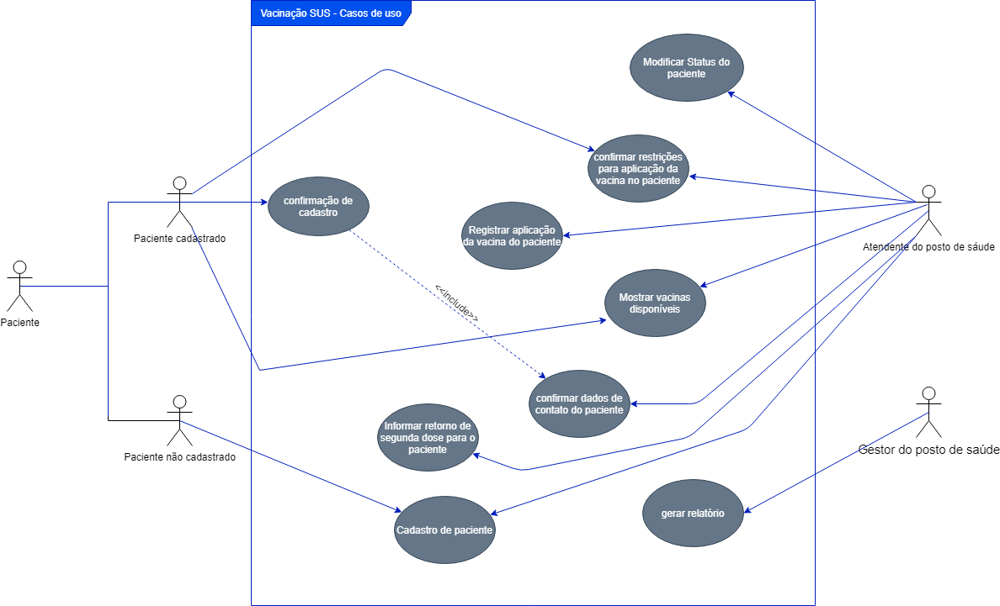
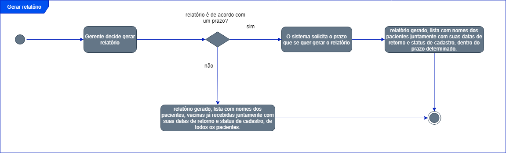
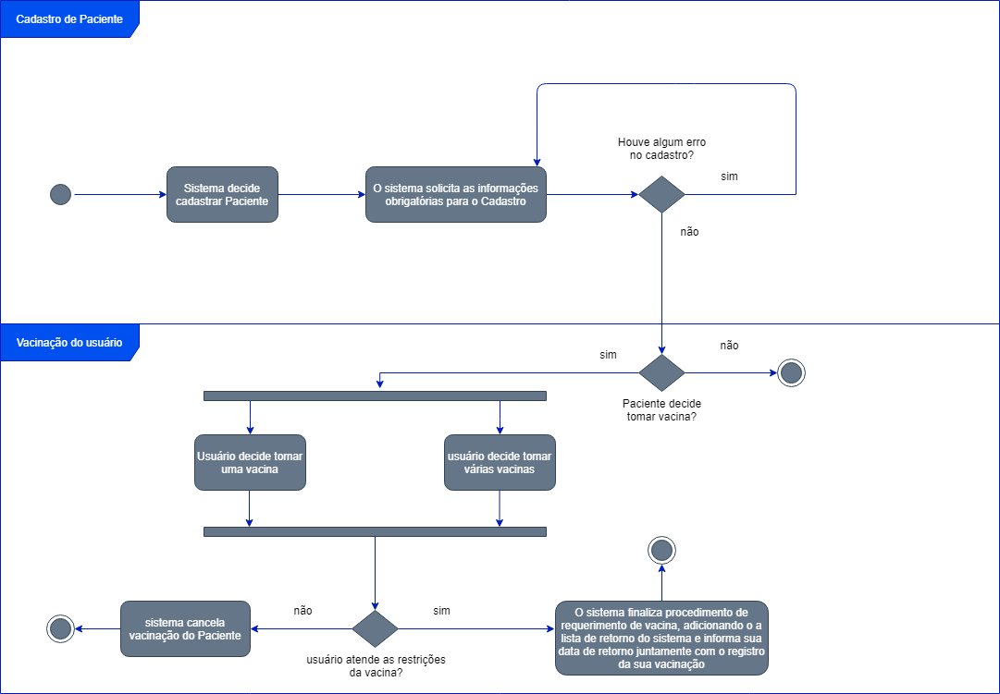
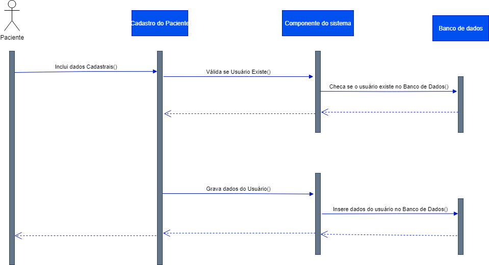

# Diagramas

# Conclusão

Durante o desenvolvimento do projeto, foi notável a utilização dos diversos conhecimentos obtidos ao longo do semestre. Este projeto proporcionou principalmente a aplicação dos conhecimentos de Análise de Requisitos.

A tarefa de fazer os diagramas neste trabalho apresentou uma demanda de trabalho e tempo , sendo assim ao final da conclusão do trabalho resulta em uma melhor visualização de como será o sistema antes de apresentar os resultados.

# Problemas Encontrados

* Para que o sistema seja comercializado em consultórios que aplicam apenas vacinação ou em postos de saúde, existe a necessidade de novas implementações e alterações que possam adequar à realidade das pessoas interessadas.

* Falta de uma nova abordagem para diferenciar o aplicativo dos outros já existentes em relação a registrar informações.

* Dificuldades na visualização dos Diagramas inicialmente.